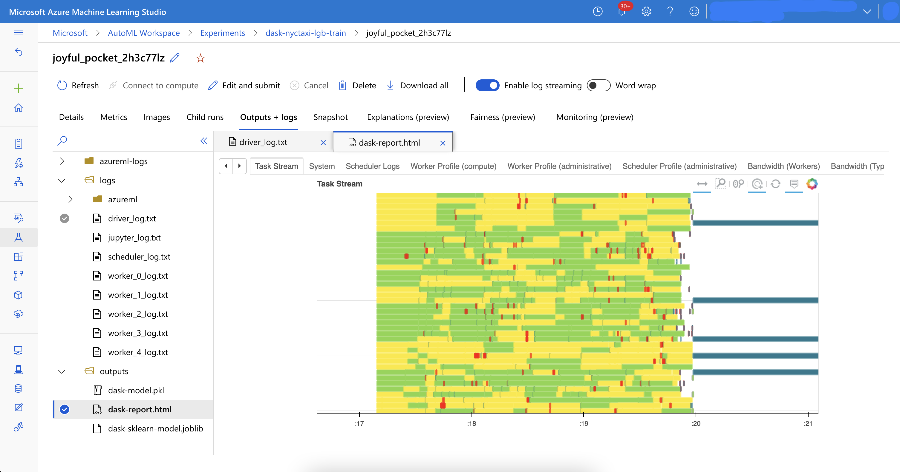

# LightGBM Distributed Training with DASK

This example shows how to use DASK to train LightGBM models in distributed mode on Azure Machine Learning.

## LightGBM DASK Distributed Training

LightGBM supports distributed training with DASK. DASK is a distributed computing framework for Python. See the following documents in reference section for more details.

## Prerequisites

- Azure Machine Learning Workspace
    - Compute Clusters for DASK
    - Compute Instance with Azure ML CLI 2.0 installed

## Getting Started

1. Create Compute Clusters for DASK clusters in your Azure Machine Learning Workspace. 
2. check train script in `src` directory.
    - DASK clusters startup script : [startDask.py]('src/startDask.py')
    - lightgbm training script : [train-lgb-dask.py]('src/train-lgb-dask.py')
3. Open [job.yml](yob.yml) and start job.

    ```bash
    az ml job create --file job.yml --stream
    ```

4. Access to Azure ML studio and see Experiment logs.
- In Experiment, `dask-report.html` in Outputs+logs tab shows DASK Performance Report like below.


## Reference

- [DASK](https://dask.org/)
- [LightGBM DASK](https://lightgbm.readthedocs.io/en/latest/Parallel-Learning-Guide.html#dask)
