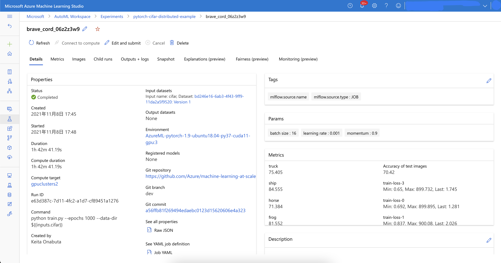
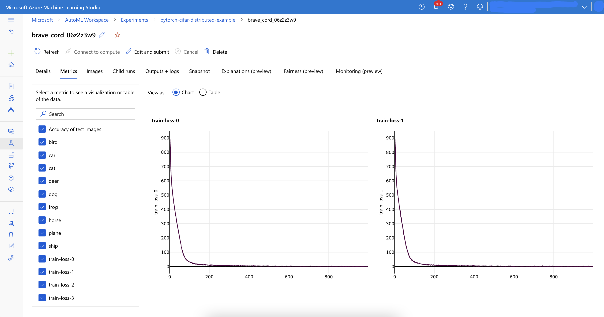
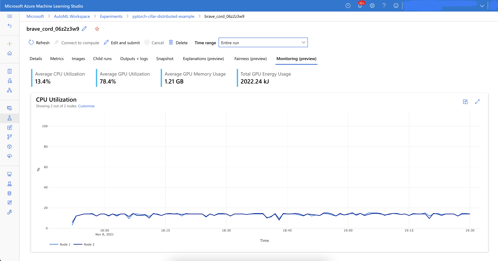

# PyTorch Distributed Data Parallel (DDP)

This example shows how to use Distributed Data Parallel (DDP) with PyTorch on Azure Machine Learning.


## Prerequisites
- Azure Machine Learning Workspace
    - Compute Clusters with GPU for distributed training
    - Compute Instance with Azure ML CLI 2.0 installed

## Getting Started

1. Create training data from python scirpt that create `data` folder.

    ```bash
    python dataprep.py
    ```

2. Create a job (Azure ML CLI 2.0 + YML configuration file) from VSCode Azure ML Extension.

    ```bash
    cd examples/train/pytorch-ddp/
    az ml job create --file job.yml --stream
    ```

3. Access to Azure ML studio and see Experiment logs.
- In Experiment, paramters & metrics is logged. And you can check system performance in Monitoring tab like below.


## Reference
- [PyTorch Distributed Data Parallel (DDP)][1]
[1]: https://pytorch.org/docs/stable/distributed.html
