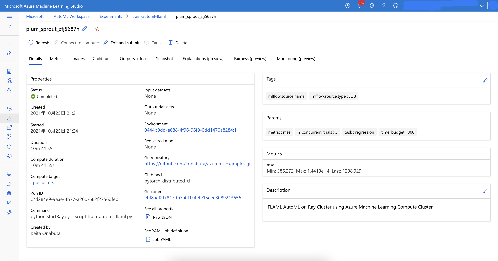
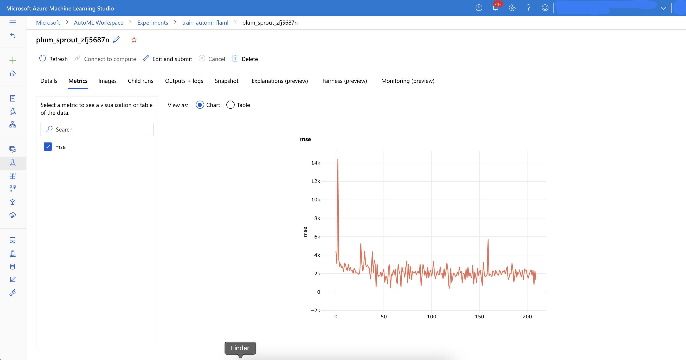
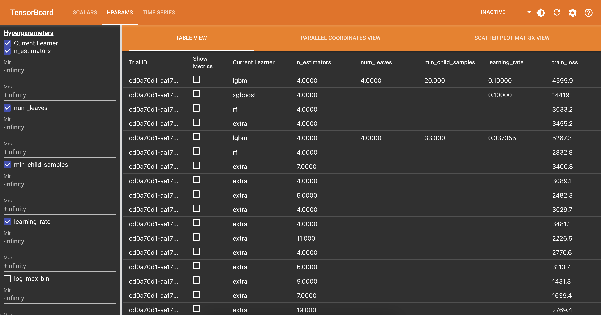
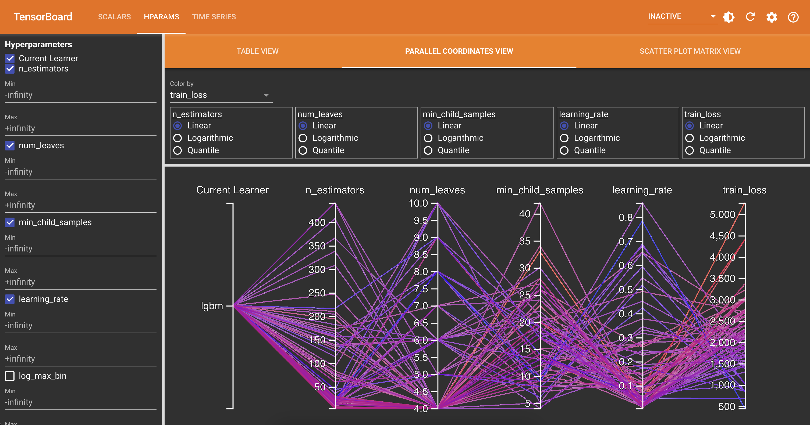

# FLAML AutoML with RAY

This example shows how to use FLAML to train a model on a dataset using RAY on Azure Machine Learning.

## FLAML with RAY
FLAML is a lightweight Python library that finds accurate machine learning models automatically, efficiently and economically. FLAML support Ray Tune for distributed search.

## Prerequisites
- Azure Machine Learning Workspace
    - Compute Clusters for Ray
    - Compute Instance with Azure ML CLI 2.0 installed

## Getting Started

1. Create a job (Azure ML CLI 2.0 + YML configuration file) from VSCode Azure ML Extension.

    ```bash
    cd examples/train/ray-flaml/
    az ml job create --file job.yml --stream
    ```

3. Access to Azure ML studio and see Experiment logs.
- In Experiment, paramters & metrics is logged. And you can check system performance in Monitoring tab like below.

4. Launch tensorboard to see the metrics.
 - Install Python packages for Tensorboard with Azure Machine Learning.

    ```bash
    pip install azureml-tensorboard tensorboard
    ```

 - Input Run ID in the first cell of [azureml-tensorboard.ipynb](azureml-tensorboard.ipynb).

    ```python
    # if you Run ID is xxxxxxx
    run_id = "xxxxxxx"
    run = Run.get(workspace=ws, run_id=run_id)
    ```
- Start Tensorboard in the second cell and see the list of trials like below.

    ```python
    tb = Tensorboard([run], local_root="logs/azureml", port=6006)
    tb.start()
    ```
    


## Reference

- [FLAML: A Framework for Learning from Data](https://github.com/microsoft/FLAML)